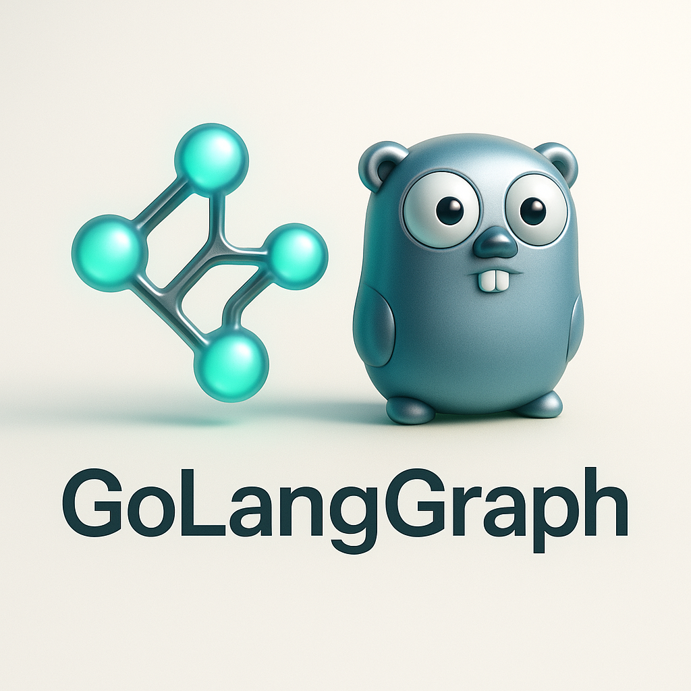

<div align="center">
  
  <h1>🚀 GoLangGraph</h1>
  <p><strong>Build Intelligent AI Agent Workflows with Go</strong></p>
  
  [](https://github.com/piotrlaczkowski/GoLangGraph/actions/workflows/ci.yml)
  [](https://codecov.io/gh/piotrlaczkowski/GoLangGraph)
  [](https://goreportcard.com/report/github.com/piotrlaczkowski/GoLangGraph)
  [](https://godoc.org/github.com/piotrlaczkowski/GoLangGraph)
  [](https://opensource.org/licenses/MIT)
  
  <p>
    <a href="#-quick-start">Quick Start</a> •
    <a href="#-features">Features</a> •
    <a href="#-examples">Examples</a> •
    <a href="#-documentation">Documentation</a> •
    <a href="#-contributing">Contributing</a>
  </p>
</div>

---

## 🎯 Overview

**GoLangGraph** is a Go framework for building AI agent workflows using graph-based execution. Create intelligent agents that can reason, use tools, and execute complex workflows with the performance and reliability of Go.

> 💡 **Perfect for**: Building AI applications, RAG systems, multi-agent workflows, and intelligent automation tools using local LLMs like Ollama.

## 🚀 Graphical Interface Studio

`GoLangGraphStudio` -> we are working on a GUI based Studio component for this library [GoLangGraphStudio](https://github.com/piotrlaczkowski/GoLangGraphStudio)
don't hesitate to contribute !

## ✨ Key Features

- 🔄 **Graph-Based Execution** - Build workflows as directed graphs with nodes and edges
- 🧠 **AI Agent Framework** - Chat, ReAct, and Tool agents with different capabilities
- 🌐 **Multi-LLM Support** - OpenAI, Ollama, and Gemini provider integrations
- 🔧 **Built-in Tools** - Calculator, web search, file operations, and more
- 💾 **State Management** - Thread-safe state containers with persistence options
- 🚀 **Auto Server** - Automatically generate REST APIs for your agents
- 📊 **Monitoring & Observability** - Grafana dashboards, Prometheus metrics, and comprehensive monitoring
- 🐳 **Production Ready** - Docker support, comprehensive testing, and error handling

## 📦 Installation

```bash
go get github.com/piotrlaczkowski/GoLangGraph
```

## 🏃 Quick Start

### Prerequisites

- Go 1.21+
- Ollama (optional, for local LLM testing)

### Simple Chat Agent

```go
package main

import (
    "context"
    "fmt"
    "log"

    "github.com/piotrlaczkowski/GoLangGraph/pkg/agent"
    "github.com/piotrlaczkowski/GoLangGraph/pkg/llm"
    "github.com/piotrlaczkowski/GoLangGraph/pkg/tools"
)

func main() {
    // Create LLM provider manager
    llmManager := llm.NewProviderManager()
    
    // Add Ollama provider (requires Ollama running locally)
    provider, err := llm.NewOllamaProvider(&llm.ProviderConfig{
        Endpoint: "http://localhost:11434",
        Model:    "gemma3:1b",
    })
    if err != nil {
        log.Fatal(err)
    }
    llmManager.RegisterProvider("ollama", provider)
    
    // Create tool registry
    toolRegistry := tools.NewToolRegistry()
    
    // Create chat agent
    config := &agent.AgentConfig{
        Name:         "chat-agent",
        Type:         agent.AgentTypeChat,
        Model:        "gemma3:1b",
        Provider:     "ollama",
        SystemPrompt: "You are a helpful AI assistant.",
        Temperature:  0.7,
        MaxTokens:    500,
    }
    
    chatAgent := agent.NewAgent(config, llmManager, toolRegistry)
    
    // Execute
    ctx := context.Background()
    execution, err := chatAgent.Execute(ctx, "Hello! Tell me about Go programming.")
    if err != nil {
        log.Fatal(err)
    }
    
    fmt.Printf("🤖 Agent: %s\n", execution.Output)
}
```

### ReAct Agent with Tools

```go
// Create ReAct agent with tools
config := &agent.AgentConfig{
    Name:          "react-agent",
    Type:          agent.AgentTypeReAct,
    Model:         "gemma3:1b",
    Provider:      "ollama",
    Tools:         []string{"calculator", "web_search"},
    MaxIterations: 5,
    SystemPrompt:  "You are a helpful assistant that can use tools to solve problems.",
}

reactAgent := agent.NewAgent(config, llmManager, toolRegistry)

// Execute complex task
execution, err := reactAgent.Execute(ctx, "What is 25 * 34?")
if err != nil {
    log.Fatal(err)
}

fmt.Printf("🧠 ReAct Agent: %s\n", execution.Output)
```

### Graph Workflow

```go
// Create custom graph workflow
graph := core.NewGraph("my-workflow")

// Add processing node
graph.AddNode("process", "Process Input", func(ctx context.Context, state *core.BaseState) (*core.BaseState, error) {
    input, _ := state.Get("user_input")
    state.Set("processed_input", fmt.Sprintf("Processing: %s", input))
    return state, nil
})

// Add response node
graph.AddNode("respond", "Generate Response", func(ctx context.Context, state *core.BaseState) (*core.BaseState, error) {
    processed, _ := state.Get("processed_input")
    state.Set("response", fmt.Sprintf("Response: %s", processed))
    return state, nil
})

// Connect nodes
graph.AddEdge("process", "respond", nil)
graph.SetStartNode("process")
graph.AddEndNode("respond")

// Execute graph
initialState := core.NewBaseState()
initialState.Set("user_input", "Hello, world!")

result, err := graph.Execute(context.Background(), initialState)
if err != nil {
    log.Fatal(err)
}

fmt.Printf("🔄 Graph Result: %v\n", result.Get("response"))
```

## 🏗️ Architecture

GoLangGraph follows a modular architecture:

```
📁 pkg/
├── 🧠 core/           # Graph execution engine and state management
├── 🤖 agent/          # AI agent implementations (Chat, ReAct, Tool)
├── 🌐 llm/            # LLM provider integrations (OpenAI, Ollama, Gemini)
├── 🔧 tools/          # Built-in tools and tool registry
├── 💾 persistence/    # Database integration and checkpointing
├── 🌐 server/         # HTTP server and WebSocket support
├── 🏗️ builder/        # Quick builder patterns for rapid development
└── 🐛 debug/          # Debugging and visualization tools
```

## 🎯 Agent Types

### 💬 Chat Agent
Simple conversational agent for basic interactions:
```go
config := &agent.AgentConfig{
    Type: agent.AgentTypeChat,
    // ... other config
}
```

### 🧠 ReAct Agent
Reasoning and Acting agent that can use tools:
```go
config := &agent.AgentConfig{
    Type:          agent.AgentTypeReAct,
    Tools:         []string{"calculator", "web_search"},
    MaxIterations: 5,
    // ... other config
}
```

### 🔧 Tool Agent
Specialized agent focused on tool usage:
```go
config := &agent.AgentConfig{
    Type:  agent.AgentTypeTool,
    Tools: []string{"file_read", "file_write", "shell"},
    // ... other config
}
```

## 🔧 Built-in Tools

- 🧮 **Calculator** - Mathematical operations
- 🔍 **Web Search** - Information retrieval
- 📁 **File Operations** - Read/write files
- 🌐 **HTTP Client** - Web requests
- ⏰ **Time** - Date and time operations
- 🖥️ **Shell** - Command execution

## 🌐 LLM Providers

### OpenAI
```go
provider, err := llm.NewOpenAIProvider(&llm.ProviderConfig{
    APIKey: "your-api-key",
    Model:  "gpt-4",
})
```

### Ollama (Local)
```go
provider, err := llm.NewOllamaProvider(&llm.ProviderConfig{
    Endpoint: "http://localhost:11434",
    Model:    "gemma3:1b",
})
```

### Gemini
```go
provider, err := llm.NewGeminiProvider(&llm.ProviderConfig{
    APIKey: "your-gemini-api-key",
    Model:  "gemini-pro",
})
```

## 🚀 Auto Server & API Generation

GoLangGraph can automatically generate REST APIs for your agents:

```go
import "github.com/piotrlaczkowski/GoLangGraph/pkg/server"

// Create auto server
config := server.DefaultAutoServerConfig()
config.Port = 8080
config.EnableWebUI = true
config.EnablePlayground = true

autoServer := server.NewAutoServer(config)

// Register your agents
autoServer.RegisterAgent("chat-agent", chatAgentDefinition)
autoServer.RegisterAgent("react-agent", reactAgentDefinition)

// Generate endpoints automatically
autoServer.GenerateEndpoints()

// Start server
ctx := context.Background()
autoServer.Start(ctx)
```

This automatically creates:
- 🌐 **REST Endpoints**: `/api/{agent-id}` for each agent
- 🎮 **Web UI**: Interactive chat interface at `/`
- 🔧 **API Playground**: Test endpoints at `/playground`
- 📊 **Metrics**: System metrics at `/metrics`
- 📋 **Health Checks**: Status monitoring at `/health`

## 📊 Examples

Explore comprehensive examples in the `/examples` directory:

- **[01-basic-chat](examples/01-basic-chat/)** - Simple chat agent
- **[02-react-agent](examples/02-react-agent/)** - ReAct agent with tools
- **[03-multi-agent](examples/03-multi-agent/)** - Multi-agent coordination
- **[04-rag-system](examples/04-rag-system/)** - RAG implementation
- **[05-streaming](examples/05-streaming/)** - Real-time streaming
- **[06-persistence](examples/06-persistence/)** - Data persistence
- **[07-tools-integration](examples/07-tools-integration/)** - Advanced tools
- **[08-production-ready](examples/08-production-ready/)** - Production deployment
- **[09-workflow-graph](examples/09-workflow-graph/)** - Complex workflows
- **[10-ideation-agents](examples/10-ideation-agents/)** - Creative agent collaboration with monitoring

### Running Examples

```bash
# Prerequisites: Install Ollama and pull models
ollama serve
ollama pull gemma3:1b

# Run any example
cd examples/01-basic-chat
go run main.go
```

## 🛠️ Development

### 📋 Prerequisites

- 🐹 **Go 1.21+** - Latest Go version
- 🦙 **Ollama** (optional) - For local LLM testing
- 🐳 **Docker** (optional) - For containerized development

### 🚀 Setup

```bash
# Clone repository
git clone https://github.com/piotrlaczkowski/GoLangGraph.git
cd GoLangGraph

# Install dependencies
make install

# Build the project
make build

# Run tests
make test

# Run examples
cd examples/01-basic-chat
go run main.go
```

### 🧪 Testing & Quality

```bash
# Run all tests
make test

# Run tests with coverage
make test-coverage

# Run integration tests
make test-integration

# Code quality checks
make lint           # Run linter
make fmt            # Format code
make vet            # Run go vet
make security       # Security scan

# Complete quality check
make check          # Run all checks
```

### 🐳 Docker & Production

```bash
# Build Docker images
make docker-build-agent

# Production deployment
make build-release

# Local development with Ollama
make ollama-setup
make test-local
```

## 🔒 Security

- ✅ **Input Validation** - All inputs are validated and sanitized
- 🛡️ **SQL Injection Prevention** - Parameterized queries throughout
- 🔑 **Secure Credential Handling** - Environment variable management
- 📝 **Audit Logging** - Comprehensive execution logging

## 🤝 Contributing

We welcome contributions! Please see our [Contributing Guide](CONTRIBUTING.md) for details.

### 🔄 Development Workflow

1. 🍴 **Fork** the repository
2. 🌿 **Create** a feature branch
3. ✨ **Make** your changes and add tests
4. 🧪 **Run** tests: `go test ./...`
5. 💾 **Commit** your changes
6. 🚀 **Push** and open a Pull Request

## 📄 License

This project is licensed under the **MIT License** - see the [LICENSE](LICENSE) file for details.

## 🆘 Support & Community

<div align="center">

| Resource | Link |
|----------|------|
| 📚 **Documentation** | [GoDoc](https://godoc.org/github.com/piotrlaczkowski/GoLangGraph) |
| 🐛 **Issues** | [GitHub Issues](https://github.com/piotrlaczkowski/GoLangGraph/issues) |
| 💬 **Discussions** | [GitHub Discussions](https://github.com/piotrlaczkowski/GoLangGraph/discussions) |
| 🎮 **Discord** | [Join our Discord](https://discord.gg/Wh9XjtCv) |


</div>

## 🙏 Acknowledgments

- 🌟 Inspired by **LangGraph** and similar workflow engines
- 🐹 Built with the excellent **Go ecosystem**
- 👥 Special thanks to **all contributors**

---

<div align="center">
  <h3>🚀 <strong>GoLangGraph</strong> - Building intelligent AI workflows with Go! 🚀</h3>
  
  <p>
    <a href="https://github.com/piotrlaczkowski/GoLangGraph">⭐ Star us on GitHub</a> •
    <a href="https://github.com/piotrlaczkowski/GoLangGraph/issues">🐛 Report Bug</a> •
    <a href="https://github.com/piotrlaczkowski/GoLangGraph/discussions">💬 Request Feature</a>
  </p>
</div>
