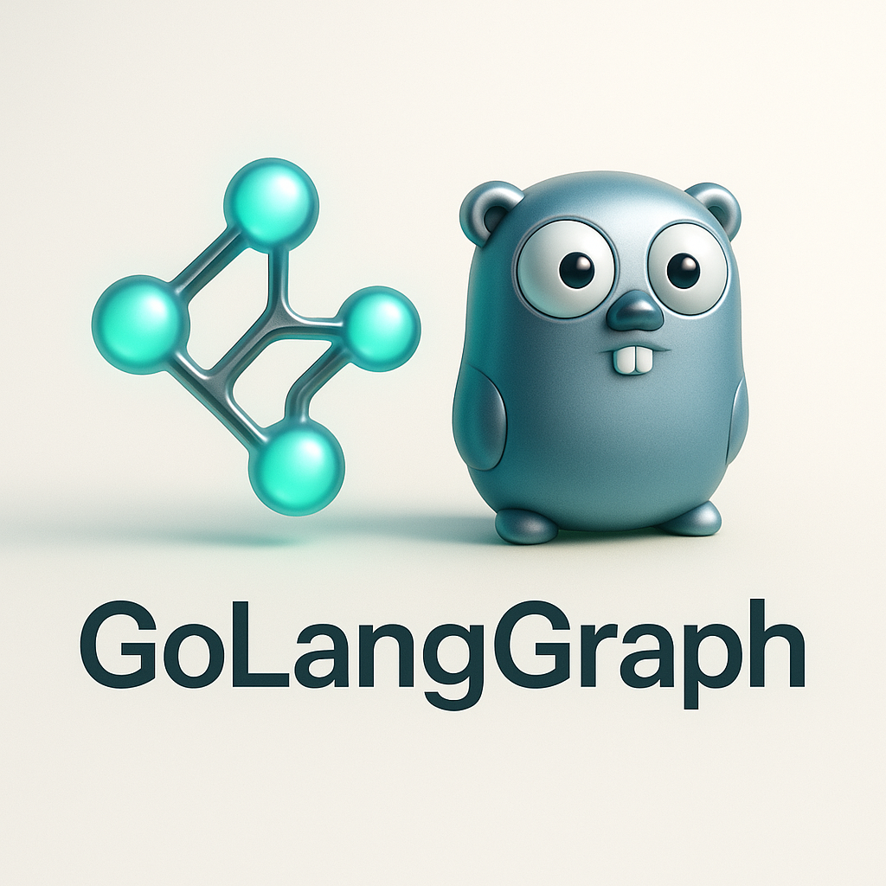
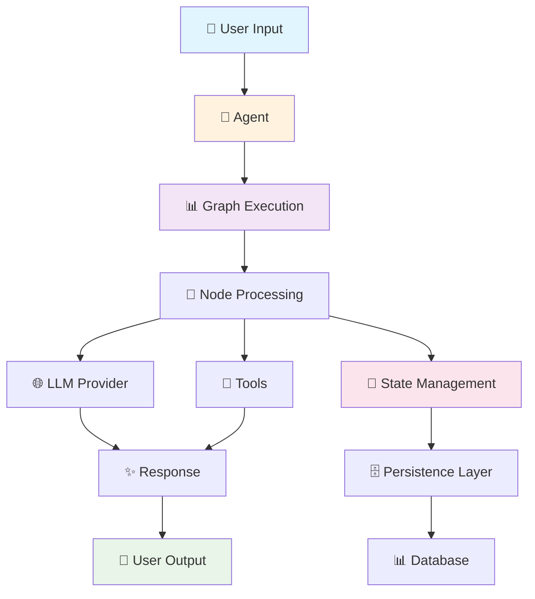

<div align="center">
  
  <h1>🚀 GoLangGraph</h1>
  <p><strong>Build Intelligent AI Agent Workflows with Go</strong></p>
</div>

---

<div class="grid cards" markdown>

-   :material-rocket-launch-outline:{ .lg .middle } **🚀 Quick Start**

    ---

    Get up and running with GoLangGraph in minutes. Build your first AI agent workflow with just a few lines of code.

    [:octicons-arrow-right-24: Getting Started](getting-started/quick-start.md)

-   :material-graph-outline:{ .lg .middle } **📊 Graph Workflows**

    ---

    Design AI workflows as directed graphs. Each node represents a computational unit, edges define execution flow.

    [:octicons-arrow-right-24: Learn More](CORE_PACKAGE.md)

-   :material-database-outline:{ .lg .middle } **💾 Persistence**

    ---

    Built-in support for PostgreSQL, Redis, and memory-based persistence. Perfect for stateful applications.

    [:octicons-arrow-right-24: Persistence Guide](PERSISTENCE_GUIDE.md)

-   :material-tools:{ .lg .middle } **🔧 Examples**

    ---

    Comprehensive examples showing real-world usage patterns with Ollama and other LLM providers.

    [:octicons-arrow-right-24: View Examples](examples/ollama-integration.md)

</div>

## 🎯 What is GoLangGraph?

**GoLangGraph** is a Go framework for building AI agent workflows with graph-based execution. It provides a clean, type-safe API for creating intelligent agents that can reason, use tools, and execute complex workflows.

> 💡 **Perfect for**: Building AI applications with local LLMs like Ollama, creating RAG systems, and developing intelligent automation tools.

## ✨ Key Features

<div class="grid cards" markdown>

-   🚀 **Graph-Based Execution**
    
    ---
    
    Design workflows as directed graphs with nodes and edges. Build complex logic with simple, composable components.

-   🔄 **State Management**
    
    ---
    
    Thread-safe state containers with persistence options. Maintain workflow state across executions.

-   🤖 **AI Agent Framework**
    
    ---
    
    Built-in support for Chat, ReAct, and Tool agents. Easy integration with multiple LLM providers.

-   🗄️ **Database Integration**
    
    ---
    
    Native support for PostgreSQL, Redis, and memory-based persistence. Checkpointing and session management.

-   🔧 **Built-in Tools**
    
    ---
    
    Comprehensive tool library including calculator, web search, file operations, and more.

-   ⚡ **High Performance**
    
    ---
    
    Optimized for production workloads with Go's native concurrency and comprehensive testing.

-   🔒 **Type Safety**
    
    ---
    
    Full Go type safety with comprehensive error handling. Catch issues at compile time.

-   🐳 **Production Ready**
    
    ---
    
    Docker support, comprehensive testing, and everything you need for production deployment.

</div>

## 🏃 Quick Example

```go
package main

import (
    "context"
    "fmt"
    "log"
    
    "github.com/piotrlaczkowski/GoLangGraph/pkg/agent"
    "github.com/piotrlaczkowski/GoLangGraph/pkg/llm"
    "github.com/piotrlaczkowski/GoLangGraph/pkg/tools"
)

func main() {
    // Create LLM provider manager
    llmManager := llm.NewProviderManager()
    
    // Add Ollama provider
    provider, err := llm.NewOllamaProvider(&llm.ProviderConfig{
        Endpoint: "http://localhost:11434",
        Model:    "gemma3:1b",
    })
    if err != nil {
        log.Fatal(err)
    }
    llmManager.RegisterProvider("ollama", provider)
    
    // Create tool registry
    toolRegistry := tools.NewToolRegistry()
    
    // Create agent
    config := &agent.AgentConfig{
        Name:         "chat-agent",
        Type:         agent.AgentTypeChat,
        Model:        "gemma3:1b",
        Provider:     "ollama",
        SystemPrompt: "You are a helpful AI assistant.",
        Temperature:  0.7,
    }
    
    chatAgent := agent.NewAgent(config, llmManager, toolRegistry)
    
    // Execute
    ctx := context.Background()
    execution, err := chatAgent.Execute(ctx, "Hello! Tell me about Go programming.")
    if err != nil {
        log.Fatal(err)
    }
    
    fmt.Printf("🤖 Agent: %s\n", execution.Output)
}
```

## 🏗️ Architecture Overview



## 🎯 Use Cases

<div class="grid cards" markdown>

-   🤖 **AI Agents**
    
    ---
    
    Build intelligent agents that can reason, plan, and execute tasks using various LLM providers.

-   🔍 **RAG Applications**
    
    ---
    
    Create Retrieval-Augmented Generation systems with database integration for knowledge retrieval.

-   🤝 **Multi-Agent Systems**
    
    ---
    
    Design workflows where multiple specialized agents collaborate to solve complex problems.

-   📊 **Data Processing**
    
    ---
    
    Build intelligent data processing workflows that can adapt and make decisions based on content.

-   🛠️ **Automation**
    
    ---
    
    Create smart automation systems that can handle exceptions and make intelligent decisions.

</div>

## 🌟 Community & Support

<div class="grid cards" markdown>

-   :material-github:{ .lg .middle } **⭐ GitHub**

    ---

    Star the project, report issues, and contribute to the codebase. Join our growing community!

    [:octicons-arrow-right-24: GitHub Repository](https://github.com/piotrlaczkowski/GoLangGraph)

-   :material-book-open:{ .lg .middle } **📚 Documentation**

    ---

    Comprehensive guides, examples, and API reference to help you build AI workflows.

    [:octicons-arrow-right-24: Browse Docs](getting-started/quick-start.md)

-   :material-bug:{ .lg .middle } **🐛 Issues**

    ---

    Report bugs, request features, and get help from the community. We're here to help!

    [:octicons-arrow-right-24: Report Issue](https://github.com/piotrlaczkowski/GoLangGraph/issues)

-   :material-chat:{ .lg .middle } **💬 Discussions**

    ---

    Join discussions about features, usage patterns, and best practices with other developers.

    [:octicons-arrow-right-24: Join Discussions](https://github.com/piotrlaczkowski/GoLangGraph/discussions)

</div>

## 🚀 Why Choose GoLangGraph?

<div class="grid cards" markdown>

-   ⚡ **Performance**
    
    ---
    
    Built with Go's performance and concurrency in mind. Optimized for production workloads.

-   👨‍💻 **Developer Experience**
    
    ---
    
    Clean, intuitive API with excellent error handling and debugging tools. Comprehensive examples.

-   🏭 **Production Ready**
    
    ---
    
    Comprehensive test coverage, CI/CD pipelines, and production deployment examples.

-   🔧 **Extensible**
    
    ---
    
    Easy to extend with custom tools, LLM providers, and persistence backends.

-   🔒 **Secure**
    
    ---
    
    Built-in security features including input validation and secure credential handling.

-   🌍 **Open Source**
    
    ---
    
    MIT licensed with an active community. Contribute, customize, and build upon our foundation.

</div>

---

<div align="center">
  <h2>🚀 Ready to Build Your First AI Agent?</h2>
  <p>Get started with GoLangGraph today and build intelligent AI workflows with Go!</p>
  
  [Get Started Now!](getting-started/quick-start.md){ .md-button .md-button--primary } 
  [View Examples](examples/ollama-integration.md){ .md-button }
  [GitHub Repository](https://github.com/piotrlaczkowski/GoLangGraph){ .md-button }
</div>

---

<div align="center">
  <p><strong>🌟 Built with ❤️ by the GoLangGraph Team</strong></p>
  <p>
    <a href="https://github.com/piotrlaczkowski/GoLangGraph">⭐ Star us on GitHub</a> •
    <a href="https://github.com/piotrlaczkowski/GoLangGraph/issues">🐛 Report Bug</a> •
    <a href="https://github.com/piotrlaczkowski/GoLangGraph/discussions">💬 Request Feature</a>
  </p>
</div> 
