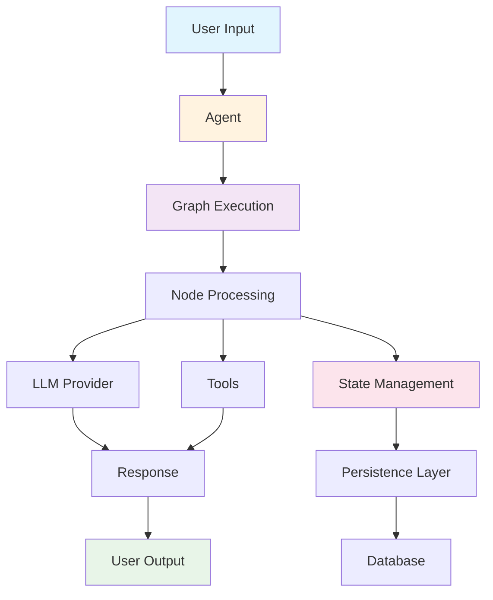

# GoLangGraph

<div class="grid cards" markdown>

-   :material-rocket-launch-outline:{ .lg .middle } **Quick Start**

    ---

    Get up and running with GoLangGraph in minutes. Build your first AI agent workflow with just a few lines of code.

    [:octicons-arrow-right-24: Getting Started](getting-started/quick-start.md)

-   :material-graph-outline:{ .lg .middle } **Graph Workflows**

    ---

    Design complex AI workflows as directed graphs. Each node represents a computational unit, edges define execution flow.

    [:octicons-arrow-right-24: Learn More](user-guide/graph-workflows.md)

-   :material-database-outline:{ .lg .middle } **Persistence & RAG**

    ---

    Built-in support for PostgreSQL, Redis, and vector databases. Perfect for RAG applications and long-running workflows.

    [:octicons-arrow-right-24: Persistence Guide](user-guide/persistence.md)

-   :material-tools:{ .lg .middle } **Rich Tooling**

    ---

    Comprehensive debugging, visualization, and monitoring tools. Built-in support for popular LLM providers.

    [:octicons-arrow-right-24: Tools & Extensions](user-guide/tools-extensions.md)

</div>

## What is GoLangGraph?

GoLangGraph is a powerful Go framework for building AI agent workflows with graph-based execution. It provides a clean, type-safe API for creating complex multi-agent systems, RAG applications, and intelligent workflows.

### Key Features

- **🚀 Graph-Based Execution**: Design workflows as directed graphs with nodes and edges
- **🔄 State Management**: Thread-safe state containers with automatic persistence
- **🤖 Multi-Agent Support**: Build complex multi-agent systems with ease
- **🗄️ Database Integration**: Native support for PostgreSQL, Redis, and vector databases
- **🔧 Rich Tooling**: Comprehensive debugging, visualization, and monitoring
- **⚡ High Performance**: Optimized for production workloads with benchmarking
- **🔒 Type Safety**: Full Go type safety with comprehensive error handling

## Quick Example

```go
package main

import (
    "context"
    "fmt"
    "log"
    
    "github.com/piotrlaczkowski/GoLangGraph/pkg/builder"
    "github.com/piotrlaczkowski/GoLangGraph/pkg/llm"
)

func main() {
    // Create a simple chat agent
    agent := builder.OneLineChat("MyAgent")
    
    // Configure with OpenAI
    provider, err := llm.NewOpenAIProvider(llm.OpenAIConfig{
        APIKey: "your-api-key",
        Model:  "gpt-4",
    })
    if err != nil {
        log.Fatal(err)
    }
    
    agent.SetLLMProvider(provider)
    
    // Execute the agent
    ctx := context.Background()
    response, err := agent.Execute(ctx, "Hello, world!")
    if err != nil {
        log.Fatal(err)
    }
    
    fmt.Printf("Agent Response: %s\n", response.Content)
}
```

## Architecture Overview



## Use Cases

### 🤖 AI Agents
Build intelligent agents that can reason, plan, and execute complex tasks using various LLM providers.

### 🔍 RAG Applications
Create sophisticated Retrieval-Augmented Generation systems with vector database integration.

### 🔄 Multi-Agent Systems
Design workflows where multiple specialized agents collaborate to solve complex problems.

### 📊 Data Processing Pipelines
Build intelligent data processing workflows that can adapt and make decisions based on content.

### 🛠️ Automation Workflows
Create smart automation systems that can handle exceptions and make intelligent decisions.

## Community & Support

<div class="grid cards" markdown>

-   :material-github:{ .lg .middle } **GitHub**

    ---

    Star the project, report issues, and contribute to the codebase.

    [:octicons-arrow-right-24: GitHub Repository](https://github.com/piotrlaczkowski/GoLangGraph)

-   :material-chat:{ .lg .middle } **Discord**

    ---

    Join our community for real-time discussions and support.

    [:octicons-arrow-right-24: Join Discord](https://discord.gg/golanggraph)

-   :material-book-open:{ .lg .middle } **Documentation**

    ---

    Comprehensive guides, examples, and API reference.

    [:octicons-arrow-right-24: Browse Docs](getting-started/quick-start.md)

-   :material-bug:{ .lg .middle } **Issues**

    ---

    Report bugs, request features, and get help from the community.

    [:octicons-arrow-right-24: Report Issue](https://github.com/piotrlaczkowski/GoLangGraph/issues)

</div>

## Why Choose GoLangGraph?

### Performance First
Built with Go's performance and concurrency in mind. Optimized for production workloads with comprehensive benchmarking.

### Developer Experience
Clean, intuitive API with excellent error handling and debugging tools. Comprehensive documentation and examples.

### Production Ready
Battle-tested with comprehensive test coverage, CI/CD pipelines, and production deployment guides.

### Extensible
Plugin architecture allows easy extension with custom tools, LLM providers, and persistence backends.

---

Ready to build your first AI agent? [Get started now!](getting-started/quick-start.md){ .md-button .md-button--primary } 