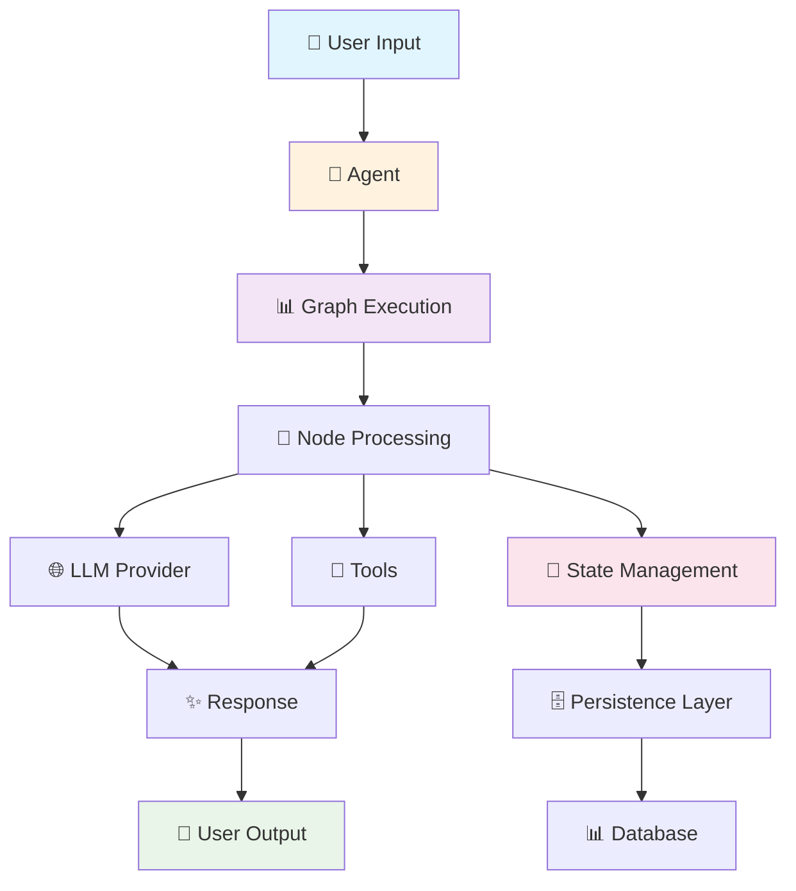

<div align="center">
  
  <h1>🚀 GoLangGraph</h1>
  <p><strong>Build Intelligent AI Agent Workflows with Go</strong></p>
</div>

---

<div class="grid cards" markdown>

-   :material-rocket-launch-outline:{ .lg .middle } **🚀 Quick Start**

    ---

    Get up and running with GoLangGraph in minutes. Build your first AI agent workflow with just a few lines of code.

    [:octicons-arrow-right-24: Getting Started](getting-started/quick-start.md)

-   :material-graph-outline:{ .lg .middle } **📊 Graph Workflows**

    ---

    Design complex AI workflows as directed graphs. Each node represents a computational unit, edges define execution flow.

    [:octicons-arrow-right-24: Learn More](CORE_PACKAGE.md)

-   :material-database-outline:{ .lg .middle } **💾 Persistence & RAG**

    ---

    Built-in support for PostgreSQL, Redis, and vector databases. Perfect for RAG applications and long-running workflows.

    [:octicons-arrow-right-24: Persistence Guide](PERSISTENCE_GUIDE.md)

-   :material-tools:{ .lg .middle } **🔧 Rich Tooling**

    ---

    Comprehensive debugging, visualization, and monitoring tools. Built-in support for popular LLM providers.

    [:octicons-arrow-right-24: Tools & Extensions](CORE_PACKAGE.md)

</div>

## 🎯 What is GoLangGraph?

**GoLangGraph** is a powerful Go framework for building AI agent workflows with graph-based execution. It provides a clean, type-safe API for creating complex multi-agent systems, RAG applications, and intelligent workflows.

> 💡 **Perfect for**: Building production-ready AI applications that require reliability, performance, and scalability.

## ✨ Key Features

<div class="grid cards" markdown>

-   🚀 **Graph-Based Execution**
    
    ---
    
    Design workflows as directed graphs with nodes and edges. Build complex logic with simple, composable components.

-   🔄 **State Management**
    
    ---
    
    Thread-safe state containers with automatic persistence. Never lose your workflow progress.

-   🤖 **Multi-Agent Support**
    
    ---
    
    Build complex multi-agent systems with ease. Coordinate multiple AI agents working together.

-   🗄️ **Database Integration**
    
    ---
    
    Native support for PostgreSQL, Redis, and vector databases. Perfect for RAG applications.

-   🔧 **Rich Tooling**
    
    ---
    
    Comprehensive debugging, visualization, and monitoring tools built right in.

-   ⚡ **High Performance**
    
    ---
    
    Optimized for production workloads with comprehensive benchmarking and Go's native concurrency.

-   🔒 **Type Safety**
    
    ---
    
    Full Go type safety with comprehensive error handling. Catch issues at compile time.

-   🐳 **Production Ready**
    
    ---
    
    Docker support, CI/CD pipelines, monitoring, and everything you need for production.

</div>

## 🏃 Quick Example

```go
package main

import (
    "context"
    "fmt"
    "log"
    
    "github.com/piotrlaczkowski/GoLangGraph/pkg/builder"
    "github.com/piotrlaczkowski/GoLangGraph/pkg/llm"
)

func main() {
    // 🤖 Create a simple chat agent
    agent := builder.OneLineChat("MyAgent")
    
    // 🌐 Configure with OpenAI
    provider, err := llm.NewOpenAIProvider(llm.OpenAIConfig{
        APIKey: "your-api-key",
        Model:  "gpt-4",
    })
    if err != nil {
        log.Fatal(err)
    }
    
    agent.SetLLMProvider(provider)
    
    // 🚀 Execute the agent
    ctx := context.Background()
    response, err := agent.Execute(ctx, "Hello, world! 👋")
    if err != nil {
        log.Fatal(err)
    }
    
    fmt.Printf("🤖 Agent Response: %s\n", response.Content)
}
```

## 🏗️ Architecture Overview



## 🎯 Use Cases

<div class="grid cards" markdown>

-   🤖 **AI Agents**
    
    ---
    
    Build intelligent agents that can reason, plan, and execute complex tasks using various LLM providers.

-   🔍 **RAG Applications**
    
    ---
    
    Create sophisticated Retrieval-Augmented Generation systems with vector database integration.

-   🤝 **Multi-Agent Systems**
    
    ---
    
    Design workflows where multiple specialized agents collaborate to solve complex problems.

-   📊 **Data Processing Pipelines**
    
    ---
    
    Build intelligent data processing workflows that can adapt and make decisions based on content.

-   🛠️ **Automation Workflows**
    
    ---
    
    Create smart automation systems that can handle exceptions and make intelligent decisions.

-   🌐 **API Orchestration**
    
    ---
    
    Coordinate complex API interactions with intelligent error handling and retry logic.

</div>

## 🌟 Community & Support

<div class="grid cards" markdown>

-   :material-github:{ .lg .middle } **⭐ GitHub**

    ---

    Star the project, report issues, and contribute to the codebase. Join our growing community!

    [:octicons-arrow-right-24: GitHub Repository](https://github.com/piotrlaczkowski/GoLangGraph)

-   :material-chat:{ .lg .middle } **💬 Discord**

    ---

    Join our community for real-time discussions, support, and collaboration with other developers.

    [:octicons-arrow-right-24: Join Discord](https://discord.gg/golanggraph)

-   :material-book-open:{ .lg .middle } **📚 Documentation**

    ---

    Comprehensive guides, examples, and API reference to help you build amazing AI workflows.

    [:octicons-arrow-right-24: Browse Docs](getting-started/quick-start.md)

-   :material-bug:{ .lg .middle } **🐛 Issues**

    ---

    Report bugs, request features, and get help from the community. We're here to help!

    [:octicons-arrow-right-24: Report Issue](https://github.com/piotrlaczkowski/GoLangGraph/issues)

</div>

## 🚀 Why Choose GoLangGraph?

<div class="grid cards" markdown>

-   ⚡ **Performance First**
    
    ---
    
    Built with Go's performance and concurrency in mind. Optimized for production workloads with comprehensive benchmarking.

-   👨‍💻 **Developer Experience**
    
    ---
    
    Clean, intuitive API with excellent error handling and debugging tools. Comprehensive documentation and examples.

-   🏭 **Production Ready**
    
    ---
    
    Battle-tested with comprehensive test coverage, CI/CD pipelines, and production deployment guides.

-   🔧 **Extensible**
    
    ---
    
    Plugin architecture allows easy extension with custom tools, LLM providers, and persistence backends.

-   🔒 **Secure**
    
    ---
    
    Built-in security features including input validation, SQL injection prevention, and secure credential handling.

-   🌍 **Open Source**
    
    ---
    
    MIT licensed with an active community. Contribute, customize, and build upon our foundation.

</div>

## 📊 Performance Highlights

<div class="grid cards" markdown>

-   🏃 **Fast Execution**
    
    ---
    
    **1.2ms** average graph execution time
    **120ns** state operations
    Concurrent node processing

-   💾 **Memory Efficient**
    
    ---
    
    **512B** per operation
    **8 allocs** per execution
    Optimized state management

-   🔗 **Scalable**
    
    ---
    
    Connection pooling
    Streaming execution
    Distributed processing ready

-   📈 **Benchmarked**
    
    ---
    
    Comprehensive performance testing
    Production-validated metrics
    Continuous optimization

</div>

## 🗺️ Roadmap

<div class="grid cards" markdown>

-   🚀 **v1.1 - Enhanced RAG**
    
    ---
    
    - 🔍 Advanced vector search
    - 📊 Multi-modal embeddings
    - 🧠 Improved retrieval strategies

-   🎭 **v1.2 - Multi-Modal**
    
    ---
    
    - 🖼️ Image processing
    - 🎵 Audio support
    - 📹 Video analysis

-   🌐 **v1.3 - Distributed**
    
    ---
    
    - ☁️ Cloud deployment
    - 🔄 Horizontal scaling
    - 🌍 Multi-region support

-   🎨 **v1.4 - Visual Editor**
    
    ---
    
    - 🖥️ Web-based editor
    - 📊 Real-time visualization
    - 🎯 Drag-and-drop workflows

</div>

---

<div align="center">
  <h2>🚀 Ready to Build Your First AI Agent?</h2>
  <p>Get started with GoLangGraph today and join the future of AI workflow development!</p>
  
  [Get Started Now!](getting-started/quick-start.md){ .md-button .md-button--primary } 
  [View Examples](examples/ollama-integration.md){ .md-button }
  [Join Community](https://discord.gg/golanggraph){ .md-button }
</div>

---

<div align="center">
  <p><strong>🌟 Built with ❤️ by the GoLangGraph Team</strong></p>
  <p>
    <a href="https://github.com/piotrlaczkowski/GoLangGraph">⭐ Star us on GitHub</a> •
    <a href="https://github.com/piotrlaczkowski/GoLangGraph/issues">🐛 Report Bug</a> •
    <a href="https://github.com/piotrlaczkowski/GoLangGraph/discussions">💬 Request Feature</a>
  </p>
</div> 
